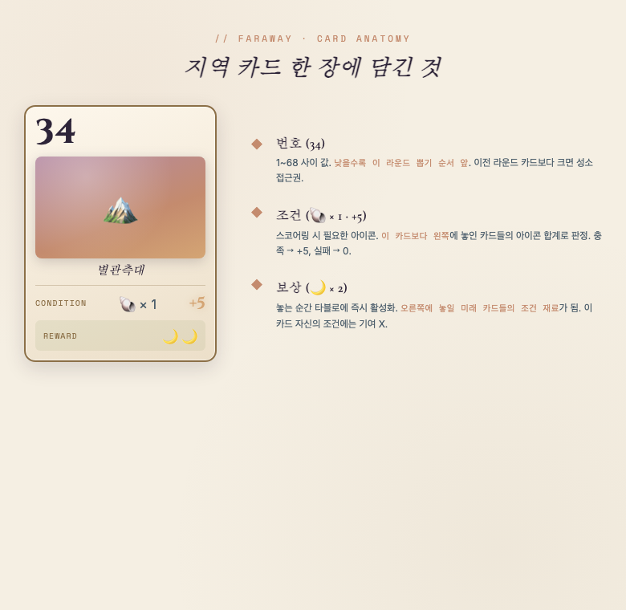
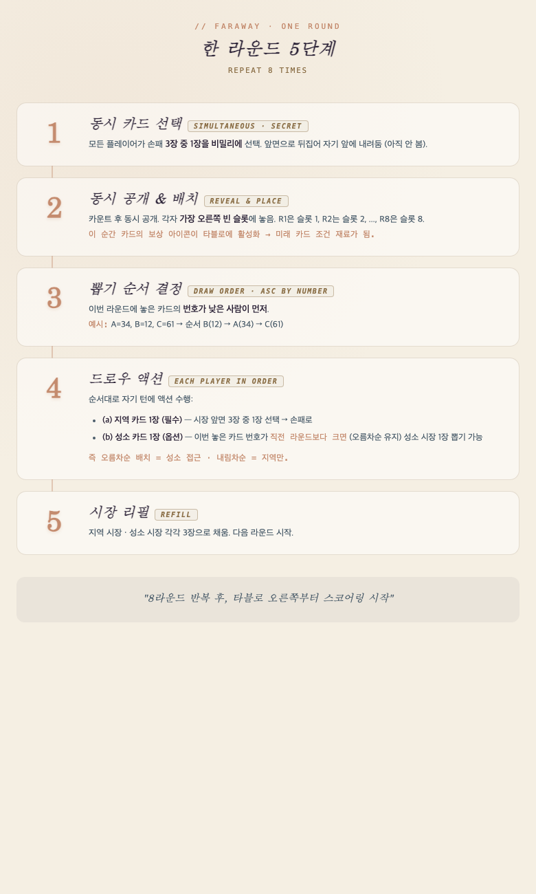
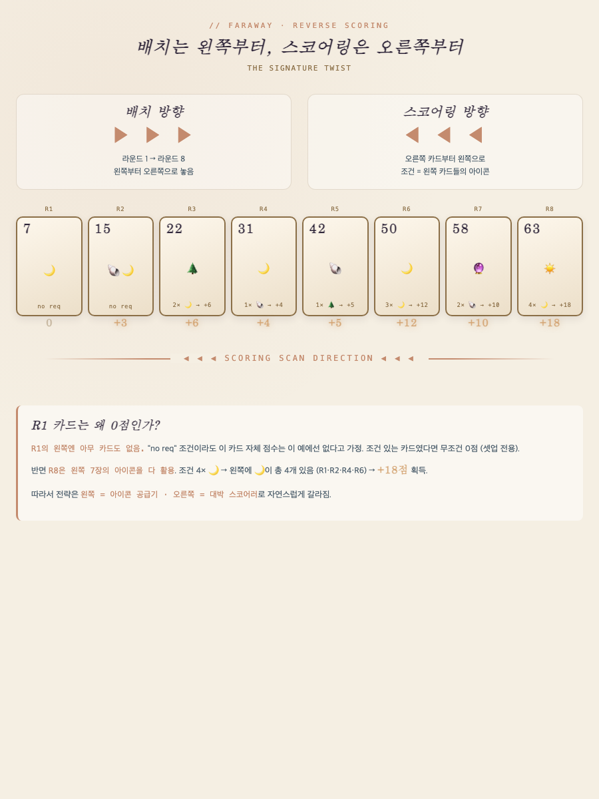
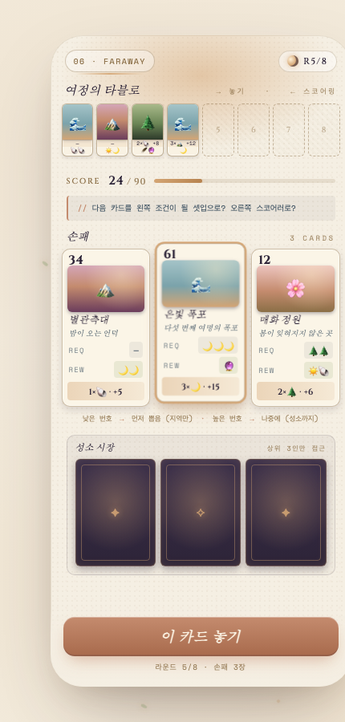

# 06 · FARAWAY · 솔로 모바일 remake

> **원작**: Faraway (Corentin Lebrat & Johannes Goupy, 2023)
> **수상**: Kennerspiel des Jahres 2024

---

## 한 줄 요약

**카드는 왼→오로 놓지만, 점수는 오→왼으로 계산되는 15분 판타지 카드 게임.**

---

## 🎴 카드는 어떻게 생겼나

- **번호** — 1~68 · 낮으면 뽑기 순서 앞
- **조건** — 스코어링 시 필요한 아이콘
- **보상** — 놓으면 즉시 타블로에 활성화 → 미래 카드 조건 재료

---

## 🔁 한 라운드는 이렇게 흘러간다 (8라운드 반복)

각 라운드 5단계 · 정말 간단:
1. 손패 3장 중 1장 비밀 선택
2. 동시 공개 → 타블로 왼쪽부터 순서대로 배치
3. 낮은 번호 카드부터 뽑기 순서
4. 지역 카드 1장 + (오름차순이면) 성소 1장
5. 시장 리필

---

## ⭐ 핵심 트릭: 역방향 스코어링

**중요한 함의**:
- **첫 번째 놓는 카드 (R1)** = 왼쪽에 아무것도 없음 → 조건 카드면 무조건 0점 → **셋업 전용 자리**
- **마지막 놓는 카드 (R8)** = 왼쪽 7장 다 활용 → **대박 스코어러 자리**
- 왼쪽 = 아이콘 공급기 · 오른쪽 = 스코어러라는 큰 그림이 자연스레 잡힘

---

## 🎯 매치 화면은 이런 느낌

- **상단**: 8칸 타블로 (지금까지 놓은 카드들)
- **중단**: 손패 3장 (탭해서 선택)
- **하단**: 지역 시장 + 성소 시장 (성소는 오름차순 유지 시만 접근)

---

## 🧠 매 라운드 결정할 것 3가지

### 축 1 · 이번 카드 번호 (낮음 vs 높음)
- 낮은 카드 → 뽑기 first pick · 성소 X
- 높은 카드 → 뽑기 꼴등 · 오름차순이면 성소 O

### 축 2 · 슬롯 위치 (초반 vs 후반)
- Slot 1~2엔 **조건 없는 카드** (있어봐야 왼쪽 자원 없어 0점)
- Slot 7~8엔 **큰 조건 대박 카드** (왼쪽 자원 다 활용)

### 축 3 · 오름차순 유지
- 8라운드 내내 오름차순 = 매 라운드 성소 획득 = 스코어 폭발
- 근데 큰 번호는 몇 장 없어서 아껴야 함

---

## 🎨 톤 & 무드

**감성**: 판타지 힐링 · 새벽/황혼 · 서정적 수채화 · 종소리 · 물결

### 팔레트
| 색상 | 코드 | 용도 |
|---|---|---|
| 🟨 새벽 크림 | `#f5efe3` | 배경 |
| 🟧 노을 오렌지 | `#c48b6e` | 하이라이트 |
| 🟫 흙 브라운 | `#8b6f47` | 프레임 |
| 🟦 안개 블루 | `#4a5c6a` | 텍스트 |
| ⬛ 심야 인디고 | `#2d2438` | 심야/성소 |
| 🟨 골드 | `#d4a574` | 스코어 |
| 🟩 이끼 그린 | `#88a065` | 아이콘 |

### 타이포
- **스코어 숫자** → Cinzel (고전 세리프)
- **카드명** → Cormorant Garamond (우아 세리프 이탤릭)
- **마이크로** → Space Mono
- **본문** → Inter

---

## 🆚 챌린저스와 비교

| 항목 | Challengers! | Faraway |
|---|---|---|
| 세션 | 5-10분 × 7라운드 | 15분 × 1판 |
| 결정 밀도 | 자동 리빌 (개입 0) | 매 라운드 카드 3장 중 1장 |
| 재미 축 | 벤치 관리 · 뽑기 운 | 미래 예측 · 3중 전략 |
| 감성 | 지하 결투장 (긴장) | 새벽 탐험 (몰입) |
| 관전 vs 결정 | 관전 중심 (문제) | 결정 중심 (해결) |

---

## 🚀 왜 remake target으로 좋은가

- ✅ **룰 5분 학습 · 첫 판 15분** — 모바일과 완벽 매치
- ✅ **재플레이성 어마어마** (지역 68 + 성소 54 조합)
- ✅ **명확한 hook** — "역방향 스코어링" 한 문장으로 설명 가능
- ✅ **솔로 이미 있음** — 원작에 봇 룰 존재, 그대로 이식
- ✅ **애니메이션이 살아남** — 스코어링 세리모니 압도적 만족감
- ✅ **감성이 챌린저스와 정반대** — 완전 다른 관객층

---

## 📋 MVP 스코프 (2주 빌드)

### Week 1 · 코어 매치
- 지역 카드 30장 · 성소 카드 10장 (원작 축약)
- 손패 · 타블로 · 시장 UI
- 8라운드 흐름 (선택 → 배치 → 순서 → 드로우)
- 봇 3명 (원작 규칙 이식)
- 오름차순 트래커 · 성소 접근권 판정

### Week 2 · 스코어링 + 폴리시
- 역방향 스코어링 로직
- 스코어링 세리모니 씬 (오른쪽→왼쪽 하이라이트)
- Lobby / Result 씬
- 로컬 리플레이 저장

### v2로 미룰 것
- 성소 도감 컬렉션
- Daily seed 리더보드
- 지역 언락 시스템

---

## 결정 필요 사항

1. **repo 분리 vs 현 repo 브랜치** — 새 프로젝트 spin-off?
2. **아트 스타일** — 이모지 + 색블록 MVP vs 처음부터 일러스트?
3. **원작 룰 어디까지 복원** — 68장 완전 vs 30장 축약?

---

## 🌐 라이브 목업

- 🎯 [매치 화면 (full)](https://randombattle-boardgame.vercel.app/proposals/06-faraway.html)
- 📚 [모든 제안 인덱스](https://randombattle-boardgame.vercel.app/proposals/)
