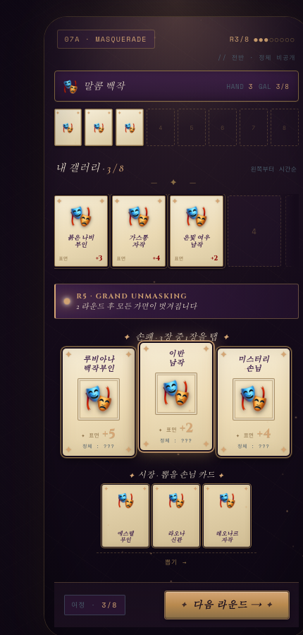
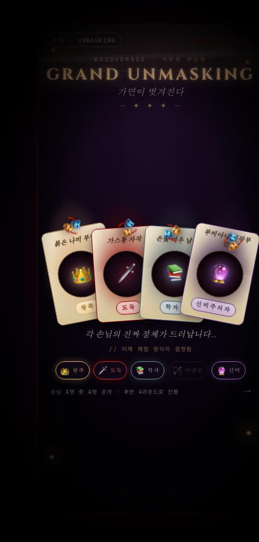
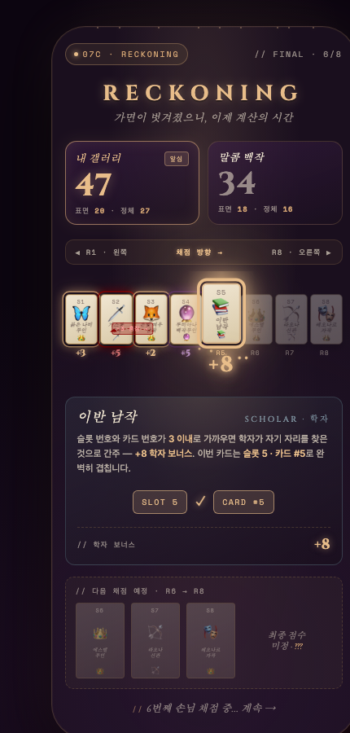

# 07 · MASQUERADE · 가면의 무도회

> **오리지널 컨셉 (실존 게임 아님)**
> 세 프로젝트(Sagrada · RandomBattle · Faraway)의 DNA를 조합한 신작 아이디어.

**작성일**: 2026-07-10
**기획**: 창작 (Faraway + Challengers! + Werewolf 계 리빌 요소 조합)

---

## 한 줄 컨셉

**8라운드 손님 배치 게임인데, 5라운드에 모든 가면이 벗겨져 정체가 공개되고 판이 뒤집힌다** — 지금 놓는 게 무엇이 될지 예측하는 심야 왕궁 미스터리.

## 🎭 어떤 느낌인가 (목업 3장)

### 전반부 · 갤러리 (R3/8, 가면 착용 중)


내 갤러리에 마스크 쓴 손님 3명 배치됨. 하단에 손패 3장, 그 아래 시장 3장. 우측 위엔 "**R5 · GRAND UNMASKING · 2 라운드 후**" 예고가 조용히 깜빡임. 정체는 아직 다 비공개.

### R5 · GRAND UNMASKING (시그니처 컷씬)


화면 어두워지고 스포트라이트 4개 켜짐. 마스크가 물리적으로 벗겨지며 4명의 정체가 색상 오라와 함께 드러남 — 왕족👑 도둑🗡 학자📚 신비주의자🔮. 화면에 반짝이 낙하 + 골드 스캔라인 sweeping.

### 채점 세리모니 · RECKONING (게임 종료 후)


왼쪽부터 순차 채점. 지금 학자(#5 이반 남작)의 판정 중 — 슬롯5·카드번호#5 매치로 +8. 앞쪽 도둑#2 → 왕족#3에서 -3 훔침 애니메이션. 상단 라이브 스코어보드로 상대와 리드가 실시간 비교됨.

---

## 왜 이 게임인가

세 프로젝트의 약점을 각 게임의 강점으로 커버:

| 이전 게임 | 약점 | Masquerade 해결 |
|---|---|---|
| Sagrada | 결정 밀도 낮음 | 매 턴 정체 예측 결정 |
| RandomBattle | 매치 중 개입 0 | 매 턴 손패 선택 |
| Faraway | 중반 드라마 없음 | **5라운드 UNMASKING 폭탄** |

세 프로젝트 다 없었던 **정보 비대칭 + 극적 리빌** 축 추가.

---

## 코어 룰

### 준비
- **손패**: 3장 (손님 카드)
- **갤러리**: 8칸 (왼→오)
- **시장**: 지역 3장, 정체 5종 팩

### 손님 카드 구조

각 카드는 **표면 정보** + **숨겨진 정체** 두 층으로 구성.

**표면 정보** (항상 보임)
```
┌──────────────┐
│ 붉은 나비 부인 │  ← 이름 (Cormorant italic)
│              │
│ [초상화]      │  ← 마스크 쓴 실루엣
│              │
│ 🎭 × 표면점수  │  ← 기본 점수
└──────────────┘
```

**숨겨진 정체** (5R까지 비공개)
- 게임 종료 시 발동하는 특수 스코어링 규칙
- 5종 카테고리 중 하나

### 정체 카테고리 (5종)

각 카테고리는 뚜렷한 성격 + 단순한 규칙:

| 정체 | 상징 색 | 채점 규칙 |
|---|---|---|
| **왕족 · Royalty** | 골드 `#d4a574` | 갤러리 내 왕족 1명당 +3 · 3명 이상이면 +10 보너스 |
| **도둑 · Thief** | 다크 레드 `#8b0000` | 인접한 왕족 카드에서 -3 훔쳐서 자기 점수로 |
| **학자 · Scholar** | 짙은 청 `#4a5c6a` | 자기 슬롯 번호와 카드 번호(1-30) 차이가 3 이내면 +8 |
| **사냥꾼 · Hunter** | 이끼 그린 `#88a065` | 자기 표면 아이콘과 인접 손님 아이콘이 겹치면 +5 |
| **신비주의자 · Mystic** | 자주 `#3d1f4a` | 갤러리 전체 정체 종류 개수마다 자기에게 +2 |

**균형 원칙**:
- 왕족 = 스택형 (많이 모을수록 이득)
- 도둑 = 카운터형 (왕족 억제)
- 학자 = 배치 규율형 (특정 슬롯에 놓아야 함)
- 사냥꾼 = 인접 시너지형 (조합 필요)
- 신비주의자 = 다양성형 (5정체 다 모으면 최고)

### 라운드 흐름

#### 전반부 (R1~R4) — 표면만 보고 배치

1. **손패 검토** — 3장 표면 정보 확인
2. **선택 & 배치** — 1장 골라 갤러리 왼쪽부터 순서대로 놓기
3. **드로우** — 시장에서 새 카드 1장 (여전히 표면만)
4. 이 시점 갤러리엔 4명, 정체 다 불명

#### R5 · GRAND UNMASKING ⭐ (시그니처 컷씬)

1. 카드 배치 후 자동 시작
2. 화면 전체 어두워짐, 촛불만 남음
3. 갤러리 4개 슬롯 위에 스포트라이트 순차 점등
4. 각 손님의 가면이 슬로우 모션으로 벗겨짐 (framer-motion `rotateY` + 오라 효과)
5. 정체별 색상 오라가 카드 주변에 발산
6. 정체 아이콘이 카드 상단에 페이드-인
7. **정체별 미묘한 위치 이동 애니메이션** (같은 정체끼리 조금씩 붙음, 실제 슬롯은 유지)
8. 3초 후 컷씬 종료, 밝기 복귀

#### 후반부 (R5~R8) — 정체 공개된 상태로 배치

- 이미 놓인 4장의 정체 완전 공개
- 새로 뽑는 카드도 이제 정체 공개된 상태로 시장에 등장
- **정체 아는 상태에서 마지막 4장 최적화** — 이미 놓은 조합을 극대화

### 채점 (RECKONING)

Faraway 스타일 세리모니, 왼→오 스캔:

**각 슬롯 처리**:
1. 표면 점수 획득
2. 정체 규칙 발동 → 정체별 색상 임팩트
3. 정체 상호작용 (도둑이 왕족 훔침 등) 순차 시각화
4. 총점 실시간 카운트업

**보스 판정** — 라운드 8 채점 완료 후:
- 특별한 콤보 달성 시 보너스
  - 5정체 다 있음 → +15 "완벽한 무도회"
  - 정체 하나에 집중 (5명) → +20 "가문의 위엄"
  - 8명 다 다른 이름 → +10 "다양성"

---

## 톤 & 무드

### 아트

- **18세기 유럽 왕궁 무도회** · 촛불빛 홀 · 대리석 · 벨벳 커튼
- 카드 초상화 = 가면 쓴 인물 실루엣 (미스터리 유지)
- UNMASKING 시 가면 벗기 애니메이션 = 카드 자체가 물리적 오브젝트처럼 회전

### 사운드
- 배경: 미뉴에트 (하프시코드 + 현악)
- 카드 놓기: 부드러운 벨벳 스치는 소리
- UNMASKING: 종소리 + 문 열리는 소리 + 낮은 붐
- 채점: 하프시코드 아르페지오

### 컬러 팔레트

| 코드 | 이름 | 용도 |
|---|---|---|
| `#1a0f1e` | 심야 자주 | 배경 |
| `#3d1f4a` | 짙은 보라 | 신비주의자 · 패널 |
| `#8b6f47` | 청동 촛불 | 프레임 |
| `#d4a574` | 골드 | 왕족 · 강조 |
| `#f0e6d2` | 크림 파치먼트 | 카드 표면 |
| `#8b0000` | 다크 레드 | 도둑 · 극적 강조 |
| `#88a065` | 이끼 그린 | 사냥꾼 |
| `#4a5c6a` | 새벽 회청 | 학자 · 텍스트 |

### 타이포

- **카드 이름 (헤딩)** → `Cormorant Garamond` italic (Faraway 재활용)
- **정체 이름 (드라마)** → `Cinzel` (Faraway 재활용)
- **마이크로 라벨** → `Space Mono`
- **본문** → `Inter`

---

## 씬 목록

### 1. LOBBY — "초대장"
- 왕궁 정문, 촛불 흔들림
- 큰 초대장 카드 CTA "무도회 입장 →"
- 이전 세션 스코어 배지

### 2. GALLERY (매치)
- 상단: 상대 갤러리 (컴팩트)
- 중간: 라운드 인디케이터 · 스코어 미리보기
- 하단 상단: 내 갤러리 (8칸)
- 하단 하단: 손패 3장 (Faraway 방식 · 탭해서 배치)
- 우측 사이드: 다음 손님 카드 뽑기 알림

### 3. UNMASKING — 컷씬 (신규 · 시그니처)
- 화면 전체 어두워짐
- 가면 벗기 순차 애니메이션
- 정체 오라 발현
- 위치 이동 미묘 애니메이션
- 3-4초 후 GALLERY로 복귀

### 4. RECKONING (채점 세리모니)
- Faraway 스타일 왼→오 스캔
- 정체 상호작용 시각화
- 총점 실시간 카운트업
- 콤보 판정 팝업

### 5. RESULT
- 최종 스코어 vs 봇들
- 승리/패배 판정
- 정체 스탯 요약 (내가 뭘 많이 모았나)
- 다음 무도회 CTA

---

## 시그니처 모멘트

### 1. GRAND UNMASKING (R5) ⭐
- 게임 전체를 반으로 나누는 최고의 순간
- 지금까지 놓은 4개가 뭘까 예측하는 재미 → 실제 공개되는 카타르시스
- 정체 조합이 좋으면 대박, 나쁘면 후반 4장으로 만회 시도

### 2. IDENTITY MIGRATION (R5 후)
- 같은 정체끼리 서로에게 이끌리는 미묘한 이동 애니메이션
- 실제 슬롯 이동은 없지만 시각적으로 동조하는 느낌
- 정체별 색상 오라가 갤러리 전체를 채움

### 3. INTERACTION CHAIN (채점 중)
- 왕족3 활성화 → 도둑2가 왕족에서 훔침 → 학자 슬롯 조건 확인 → 사냥꾼 아이콘 매칭 → 신비주의자 다양성 계산
- 각 정체가 다음 정체를 트리거하는 연쇄 시각화

### 4. PERFECT MASQUERADE (엔딩 콤보)
- 5정체 다 모으면 "완벽한 무도회" 골드 배너
- 왈츠 크레센도 + 하프시코드 폭발

---

## 현 프로젝트(Faraway) 대비 Tradeoffs

### 얻는 것
- ✅ **오리지널** — IP 부담 없음
- ✅ **극적 리빌** — 지금까지 못 넣은 축
- ✅ **감성 완전 다름** — 왕궁 미스터리 = 새 관객
- ✅ **후반 최적화 재미** — 정체 공개 후 4장이 진짜 결정
- ✅ **콤보 상호작용** — Balatro-esque 조합 재미

### 잃는 것
- ❌ **미검증** — 아무도 안 해봄 · 재미 확신 불가
- ❌ **처음부터** — 카드 40장, 정체 5종 완전 밸런싱
- ❌ **정체 규칙 학습** — 초보자 러닝 커브
- ❌ **아트 리소스** — 가면 초상화 40장 필요
- ❌ **UNMASKING 컷씬** — 시각 효과 개발 부담

---

## MVP 스코프 (2-3주 빌드)

### Week 1: 코어 매치
- [ ] 손님 카드 데이터 20장 (정체 균형 4:4:4:4:4)
- [ ] 정체 시스템 (5종 규칙 함수화)
- [ ] 갤러리 UI (8슬롯 · 왼→오 배치)
- [ ] 손패 3장 UI (Faraway 재활용)
- [ ] R1-R4 흐름
- [ ] 봇 1명 (심플 AI)

### Week 2: UNMASKING + 후반
- [ ] UNMASKING 컷씬 (마스크 벗기 애니메이션)
- [ ] 정체 아이콘 렌더링
- [ ] 정체별 색상 오라
- [ ] R5-R8 흐름 (정체 공개된 상태)
- [ ] 시장에서 정체 공개 카드 뽑기

### Week 3: RECKONING + 폴리시
- [ ] 채점 로직 (정체 5종 상호작용)
- [ ] RECKONING 세리모니 씬
- [ ] Lobby / Result 씬
- [ ] 콤보 판정 (완벽한 무도회 등)
- [ ] 로컬 리플레이

### v2로 미룰 것
- 손님 도감 (40장 컬렉션)
- 시즌 이벤트 (겨울무도회 등)
- 정체별 어치브먼트
- 4인 멀티 봇

---

## 결정 필요 사항

### A. 정체 개수 · 5개 유지?
- **5개 pros**: 균형 좋음, 신비주의자가 다양성 축 만듬
- **5개 cons**: 학습 부담
- **대안**: 4개로 축소 (왕족/도둑/학자/사냥꾼) — 신비주의자 없이

### B. R5 이후 시장 카드도 정체 공개?
- **공개**: 후반 최적화 재미 극대화
- **비공개**: 리스크 유지, 재미의 연장
- **하이브리드**: R5-R6 반공개, R7-R8 완전공개

### C. UNMASKING 이동 애니메이션 강도
- **강**: 카드가 실제로 슬롯 이동 (룰 복잡화)
- **약**: 시각적 이동만 (선호)
- **없음**: 정체만 밝히고 이동 X (심플)

### D. 손님 이름 스타일
- **유럽 클래식**: "가스통 자작", "말콤 백작" 등
- **판타지 시적**: "붉은 나비 부인", "은빛 여우 남작"
- **동양적**: "붉은 학 대감", "연꽃 궁녀"

### E. 정체 4:4:4:4:4 균형 vs 왕족·도둑 편중
- **균등**: 안전 · 예측 가능
- **편중**: 왕족·도둑을 8:8:4:4:2 로 하면 상호작용 활성화

---

## 다음 스텝

1. **위 5가지 결정 사항 확정** (사용자 취향)
2. **손님 이름 40장 스타일 결정**
3. **UNMASKING 컷씬 목업 HTML** (시각 검증)
4. **정체 규칙 프로토타입** (Vitest로 로직 검증)
5. **새 repo `masquerade-boardgame` 스캐폴딩**

## 리스크 & 검증 포인트

- **재미 검증 필수** — 프로토타입 만들어서 5회 이상 플레이하며 균형 조정
- **UNMASKING이 정말 극적인지** — 4장만 놓고 리빌하면 임팩트 없을 수도. 필요 시 UNMASKING을 R6로 미루기
- **정체 규칙이 너무 복잡한지** — 학자·사냥꾼 규칙은 초심자에게 어려울 수 있음
- **봇 AI 난이도** — 정체 공개 전 예측 능력이 관건. 봇은 랜덤 or 표면 점수 최대화만 해도 무방
